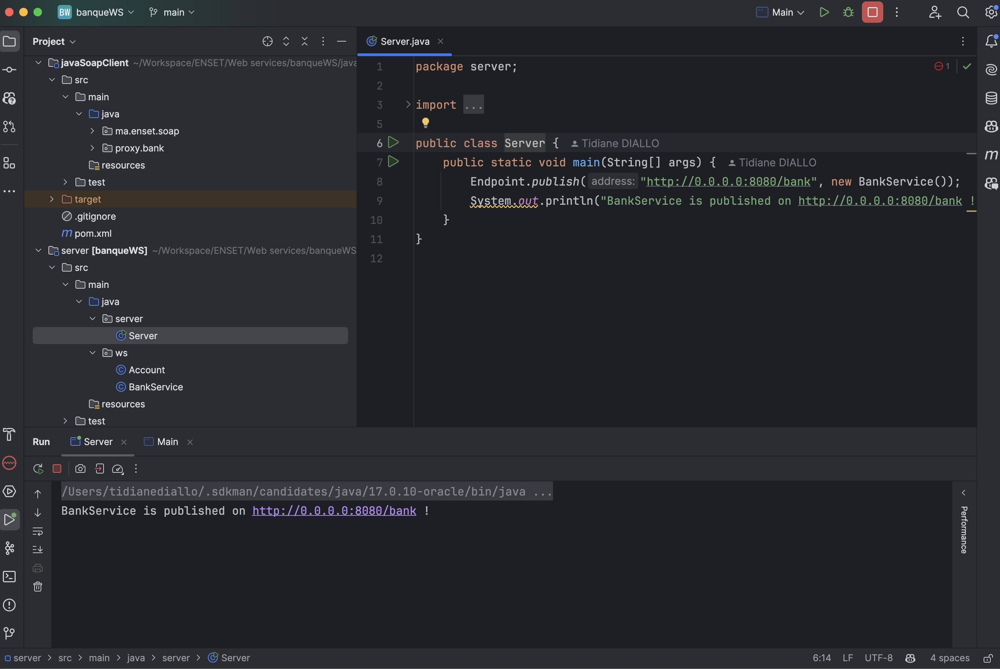
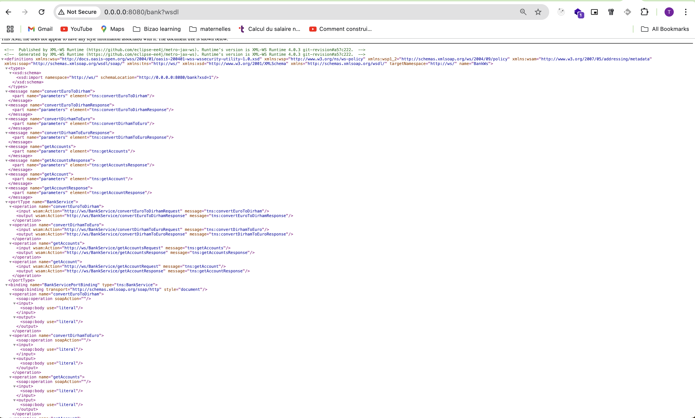
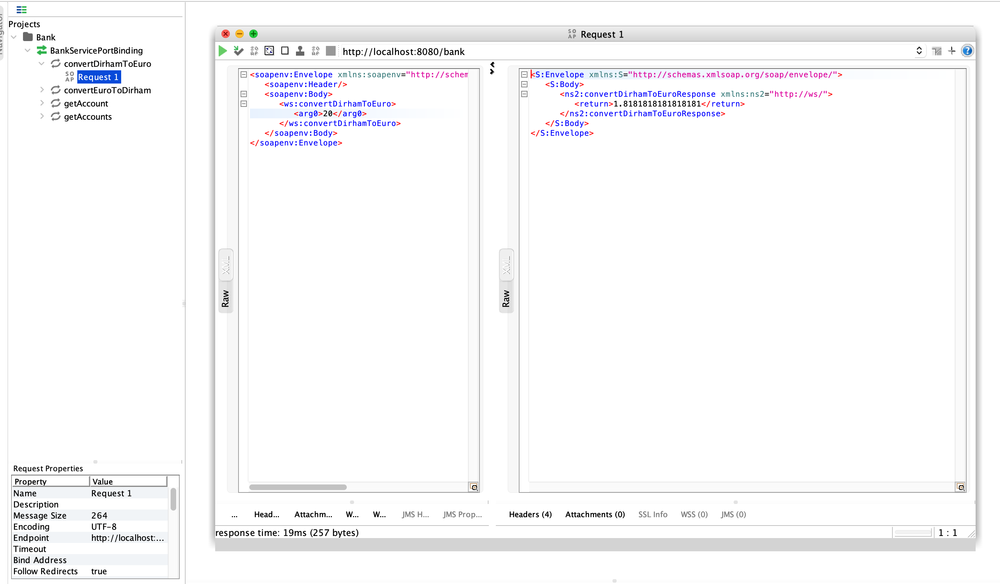
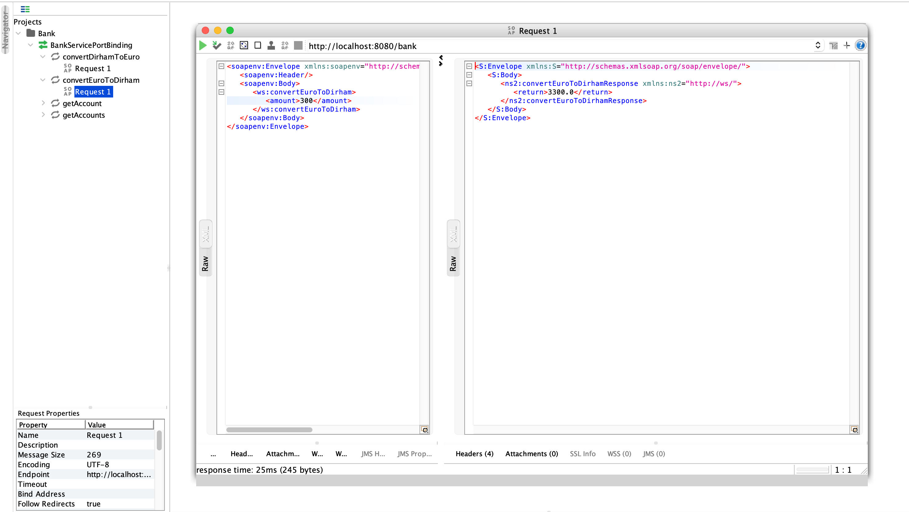
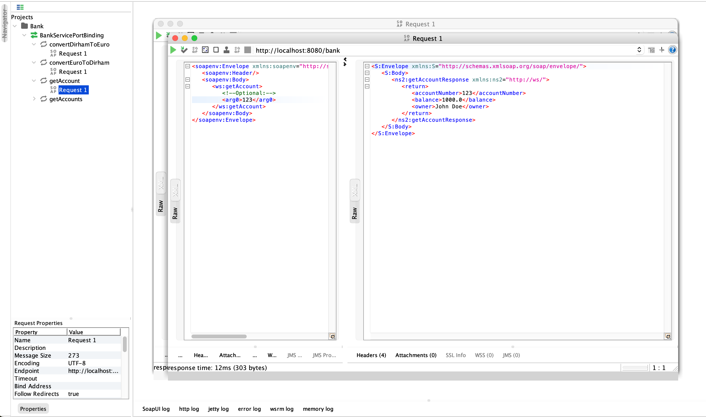
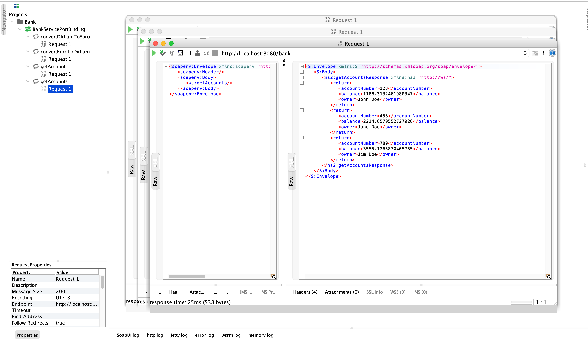
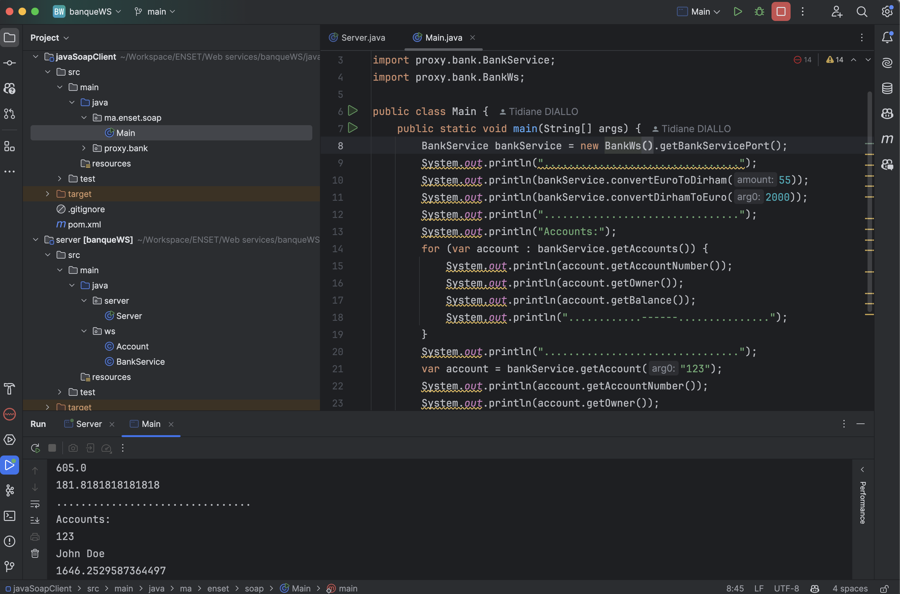
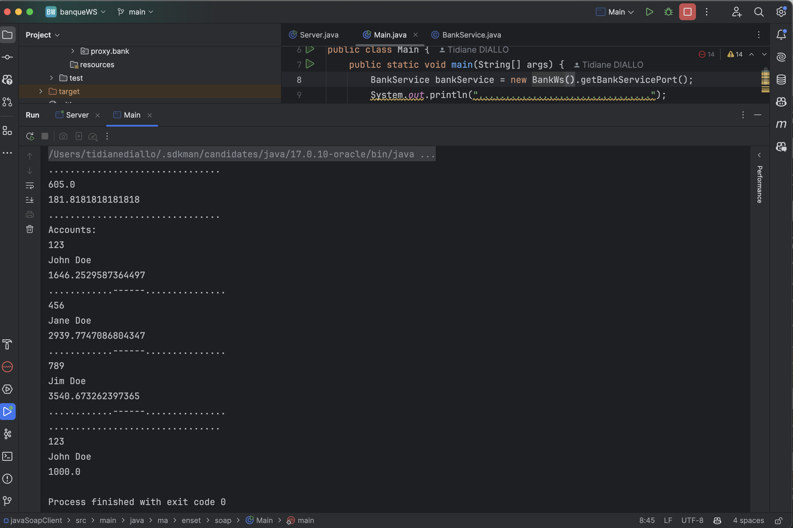

## Bank SOAP Web service application
This is a simple SOAP web service application that allows users to perform basic banking operations such as convert Euro to Dirham, convert Dirham to Euro, and get an account, get accounts list.

### Server

### Wsdl

### Test SOAPUI Request 1 (Convert Dirham to Euro)

### Test SOAPUI Request 2 (Convert Euro to Dirham)

### Test SOAPUI Request 3 (get account)

### Test SOAPUI Request 4 (get accounts list)

### Java Client Main class

### Java Client test result

